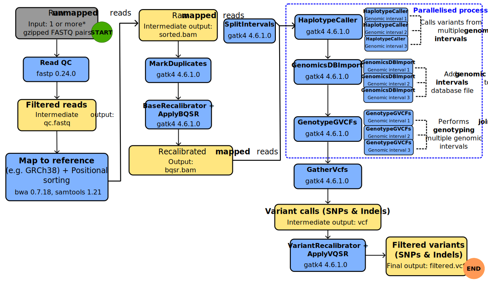
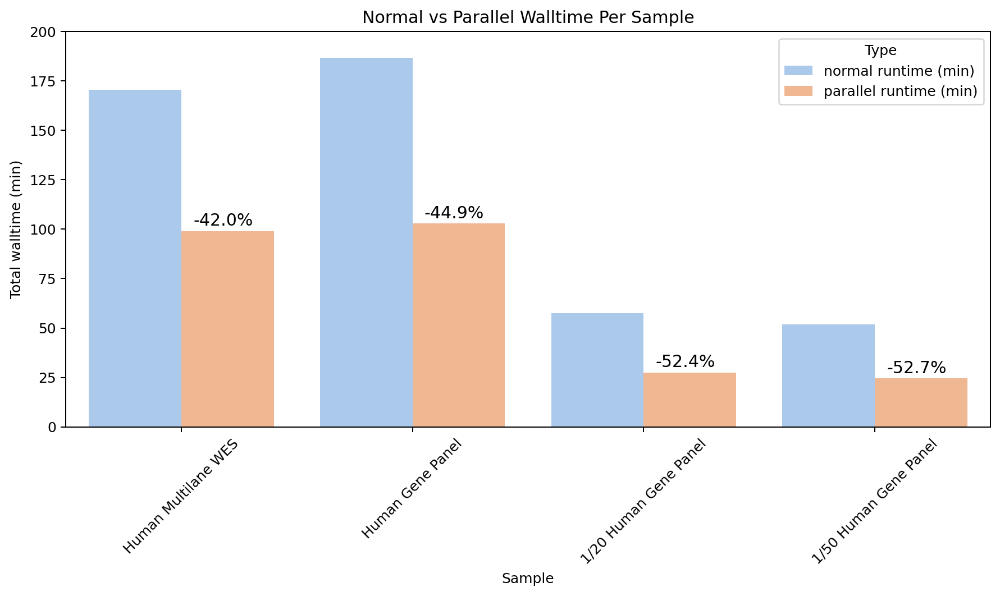

# Contents

1. [Introduction](#introduction)
2. [Requirements](#requirements)
3. [Usage](#usage)
    * [Quick download](https://github.com/engwbc/gatk_pipeline/releases/download/1.0.0/gatk_pipeline_v1.0.0.tar.gz)
    * [Main script](#main-script)
    * [Multi-lane samples](#multi-lane-samples)
    * [Variant filtering](#variant-filtering)
    * [Change notes](https://github.com/engwbc/gatk_pipeline/releases)
4. [Process](#steps)
5. [Future Plans](#future-plans)

## Introduction

This pipeline is adapted from the GATK [Genome Analysis Best Practices Workflow](https://gatk.broadinstitute.org/hc/en-us/articles/360035535912-Data-pre-processing-for-variant-discovery) to obtain genetic variants for human samples.

In brief, the pipeline converts raw, unmapped sequencing data from FASTQ files into variant calling format (VCF) files. Reads within the VCF file are sorted and mapped to a reference genome with low quality reads and adapters removed.

### Pipeline overview



### Performance

As indicated in the overview schematic, the pipeline utilises CPU parallelisation to improve computing speed by splitting genomic regions into smaller intervals and running them as multiple processes simultaneously. I found that the pipeline runs faster, reducing total processing time by approximately 48% on average across various runs (Figure 1), compared to a non-parallelised pipeline. However, these savings will depend on the complexity of your sample, your CPU speed, and system load while running the pipeline.


*Figure 1: Comparison of walltime in minutes between normal and parallelised workflows for different types samples with percentage change indicated.  Multilane WGS 30X Human refers to a sample sequenced with 4 lanes and converted to VCF with `multilane_fastq2vcf.sh`. 1/20 and 1/50 denote fractionated sequences obtained by running `seqkit split2` in which the sample was split into 20 parts and 50 parts, respectively.*

Most tasks utilise multithreading by default (e.g., `HaplotypeCaller` uses 2 threads for IntelHMM), here I explicitly refer to running tasks **in tandem** by assigning a specific amount of CPU cores. For instance, `HaplotypeCaller` is set to run simultaneously three times (`parallel --jobs 3`), by default this roughly equates to using [3 CPU cores per job](https://www.gnu.org/software/parallel/parallel_tutorial.html#number-of-simultaneous-jobs). As each CPU core typically contains 2 threads each, this corresponds to using 6 threads for `HaplotypeCaller`, therefore the system will use approximately 3 cores/6 threads in total.

Simply put, it is like having multiple chefs in a kitchen - they share their work to serve a dish in a timely manner, and not get the head chef or diners unhappy.

___

## Requirements

1. `bash` interpreter
2. `bwa`
3. `fastp`
4. `gatk4` + java development kit (JDK)
5. `samtools`
6. [`parallel`](https://www.gnu.org/software/parallel/)
7. `bcftools`

Refer to [#environment setup](#environment-setup) below for version details.
___

## Usage

### Download

* [Releases](https://github.com/engwbc/gatk_pipeline/releases)

### Environment setup

Download `gatk_environment.yml` and run the following `conda` command:

1. ```conda env create -f gatk_environment.yml```

    This might take a while as conda will create an environment containing the packages listed above (and more). **Note: installation size is ~6.5GB.**

2. Activate environment: ```conda activate gatk4```

3. Check packages:

```sh
conda list | grep -E '^(gatk4|parallel|samtools|bwa|bash|fastp|bcftools|)[[:space:]]'
```

The following output should be returned:

```sh
bash                      5.2.21               h7f99829_0    conda-forge
bcftools                  1.21                 h8b25389_0    bioconda
bwa                       0.7.18               he4a0461_1    bioconda
fastp                     0.24.0               h125f33a_0    bioconda
gatk4                     4.6.2.0         py310hdfd78af_0    bioconda
parallel                  20250422             ha770c72_0    conda-forge
samtools                  1.21                 h50ea8bc_0    bioconda
```

### Main script

**Important**: Keep `globalFunctions.sh` in the same directory as `fastq2vcf.sh` or `multilane_fastq2vcf.sh`!

```sh
bash /path/to/fastq2vcf.sh \
-i /path/to/fastq/folder \
-o /path/to/output/folder \
-r /path/to/reference.fasta \
-s /path/to/dbSNP.vcf.gz \
-L /path/to/your.interval_list
```

### Multi-lane samples

```sh
bash /path/to/mutlilane_fastq2vcf.sh \
-i /path/to/fastq/folder \
-o /path/to/output/folder \
-r /path/to/reference.fasta \
-s /path/to/dbSNP.vcf.gz    \
-L /path/to/your.interval_list
```

Make sure the fastq files contain the lane ID (`L00X`) in the filename:

* sample1_**L001**_R1_x.fastq.gz
* sample1_**L002**_R1_x.fastq.gz

### Arguments

```sh
-i : input directory (folder containing fastq files)
-o : output directory (can be a new folder, the script will create one; ensure you have write permissions!)
-r : reference genome (.fasta file)
-s : database of known polymorphic sites
-L : genome interval list (can be VCF, BED or .interval_list)
```

* SNP databasefile format refer to [GATK - BaseRecalibrator known sites](https://gatk.broadinstitute.org/hc/en-us/articles/360036898312-BaseRecalibrator#--known-sites).

* Interval file formatting, refer to [GATK - Intervals and interval lists](https://gatk.broadinstitute.org/hc/en-us/articles/360035531852-Intervals-and-interval-lists).

### Variant Filtering

**For human sequences.** VQSR may not work well for organisms lacking known high-quality variant sites. You may need to opt for hard-filtering using `gatk VariantFiltration`.

**Required files:**

These VCF files are needed for VQSR for model training:

1. `hapmap_3.3.hg38.vcf.gz`
2. `1000G_omni2.5.hg38.vcf.gz`
3. `1000G_phase1.snps.high_confidence.hg38.vcf.gz`
4. `Mills_and_1000G_gold_standard.indels.hg38.vcf.gz`
5. `Homo_sapiens_assembly38.dbsnp138.vcf.gz`

URLs for downloading are stored in `variantrecal_sites.txt`

Run the following command to download the files:

```sh
wget --directory-prefix /folder/for/vqsr/sites --input-file variantrecal_sites.txt
```

**Usage:**

```sh
bash /path/to/vcf_VariantRecalibrator.sh \
-i /path/to/unfiltered_vcf.gz \
-o /path/to/output/folder \
-r /path/to/reference.fasta \
-H /path/to/hapmap.hg38.vcf.gz \
-O /path/to/1000G_omni2.5.hg38.vcf.gz \
-T /path/to/1000G_phase1.snps.high_confidence.hg38.vcf.gz \
-M /path/to/Mills_and_1000G_gold_standard.indels.hg38.vcf.gz \
-s /path/to/dbsnp138.vcf.gz
```

[Back to top](#contents)
___

## Steps

This involves the following processes:

1. **Data pre-processing**
    * Adapter trimming and low quality read filtering using [fastp](https://github.com/OpenGene/fastp)
    * **Intermediate output:** `sample_qc.fq.gz`

2. **Mapping to reference genome**
    * Uses `bwa mem` to align sample to a reference (e.g., Homo_Sapiens_assembly38.fasta)
    * **IMPORTANT:** In principle, `bwa index` needs to be done only once, so this process is skipped if **all 5** index files (`amb`,`ann`,`bwt`,`pac`,`sa`) are found within the reference's path. However, if the alignment fails, check whether the index files are corrupted and re-index the reference with `bwa index reference.fasta`.
    * **Intermediate output:** `sample.bam`

3. **Positional sorting**
    * After alignment, reads are sorted based on genomic coordinates to the reference using `samtools sort`
    * **Intermediate output:** `sample_sorted.bam`

4. **Mark Duplicates**
    * Duplicate reads are marked by using `gatk MarkDuplicates` to reduce bias during variant detection.
    * **Intermediate output:** `sample_sorted_mkd.bam`

5. **Base Quality Score Recalibration**
    * Detect and correct for patterns of systematic errors in the base quality scores, which correspond to confidence scores given by the sequencer.
    * This is a two-step process:
        1. First, a table containing recalibration scores is generated from `BaseRecalibrator`.
        2. Second, `ApplyBQSR` is used to correct for systematic bias per base.
    * **Output:** `sample_sorted_mkd_bqsr.bam`

6. **Variant Calling**
    * SNPs and Indels are identified by `HaplotypeCaller`
    * **Intermeidate output:** `sample.g.vcf.gz`

7. **Joint genotyping**
    * Convert `g.vcf` into `.vcf` with `GenotypeGVCFs`
        * Merges multiple `g.vcf` files into a single file with `GatherVcfs`.
    * `GenomicsDBImport` is used to merge the scattered GVCFs by labelling with the sample name. According to the Broad Institute, `GenomicsDBImport` performance is faster compared to `CombineGVCFs` and serves the same purpose, so this method was chosen.
    * **Final output:** `sample.vcf.gz`

8. **VQSR** - This approach is preferred over **hard filtering** due to using machine learning to cut-off low confidence variants by collating the probability of a true variant based on multiple criteria, such as comparing the sample to a training dataset of high-quality variants, to improve filtering accuracy and flexibility.
    * **Output:** `filtered.vcf.gz`
    * Caveat: If you work with small datasets (e.g. targeted capture experiments or small number of exomes), you will run into problems. In this case, use hard filtering with `VariantFiltration` instead.
    * By default, the filtering threshold is set to 99.9% - this may need refinement for different data sets. To do so, change the value in `--truth-sensitivity-filter-level 99.9` to whatever level is optimal.

[Back to top](#contents)
___

## System and Samples Tested

The pipeline was tested on a system containing an Intel Xeon E5-2620 v4 @ 2.10GHz (8 cores, 16 threads), 64 GB RAM, 8TB HDD and Rocky Linux 8.10 (RHEL).

Paired-end test sequences with average read-depth of 30X and obtained from an Illumina MiSeq system.

Human GRCh38 `Homo_sapiens_assembly38.fasta` and `Homo_sapiens_assembly38.dbsnp138.vcf` were used as the reference genome and SNP database, respectively. Scatter intervals for splitting genomic regions during variant calling were used according to the intervals specified in `wgs_calling_regions.hg38.interval_list`. These files were collectively obtained from the [gcp-public-data--broad-references bucket](https://console.cloud.google.com/storage/browser/gcp-public-data--broad-references/hg38/v0).

Several parameters used for tools, especially for multithreaded tasks such as fastp, were based on benchmarks by the NIH Biowulf HPC[^1] and Heldenbrand et al., 2019[^2].

### Software version

* `bash 5.2.21` - source: conda-forge
* `bwa 0.7.18` - source: bioconda
* `fastp 0.24.0` - source: bioconda
* `gatk4 4.6.1.0` - source: bioconda
* `samtools 1.21` - source: bioconda
* `parallel 20250222` - source: conda-forge
* `bctools 1.21` - source: bioconda

[Back to top](#contents)
___

## Future plans

* Further code optimisations.
  * Increase parallelisation by partitioning sequences into equivalent blocks prior to `HaplotypeCaller` as recommended by Heldenbrand et. al, 2019 to reduce processing time even further.
  * Certain processes greatly benefit from multithreading, for instance, `bwa alignment`. The current code iteration assigns a fixed number of threads for these processes. For scalability, I would like to improve the pipeline by detecting the maxmimum CPU threads and dynamically assign the optimal amount based on system load.

* Conversion to workflow language, in particular, [Nextflow](https://github.com/nextflow-io/nextflow) to simplify the pipeline.

[Back to top](#contents)
___

## References

[^1]: Resch, Q. Y. and W. A practical introduction to GATK 4 on Biowulf (NIH HPC). [Online]. Available at: [https://hpc.nih.gov/training/gatk_tutorial/](https://hpc.nih.gov/training/gatk_tutorial/).

[^2]: Heldenbrand, J. R. et al. (2019). Recommendations for performance optimizations when using GATK3.8 and GATK4. BMC Bioinformatics, 20 (1), p.557. [Online]. Available at: [doi:10.1186/s12859-019-3169-7](https://doi.org/10.1186/s12859-019-3169-7).
